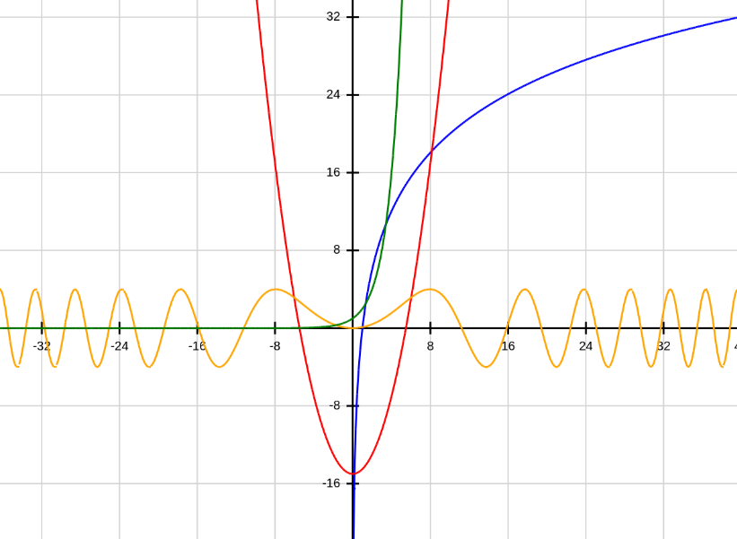
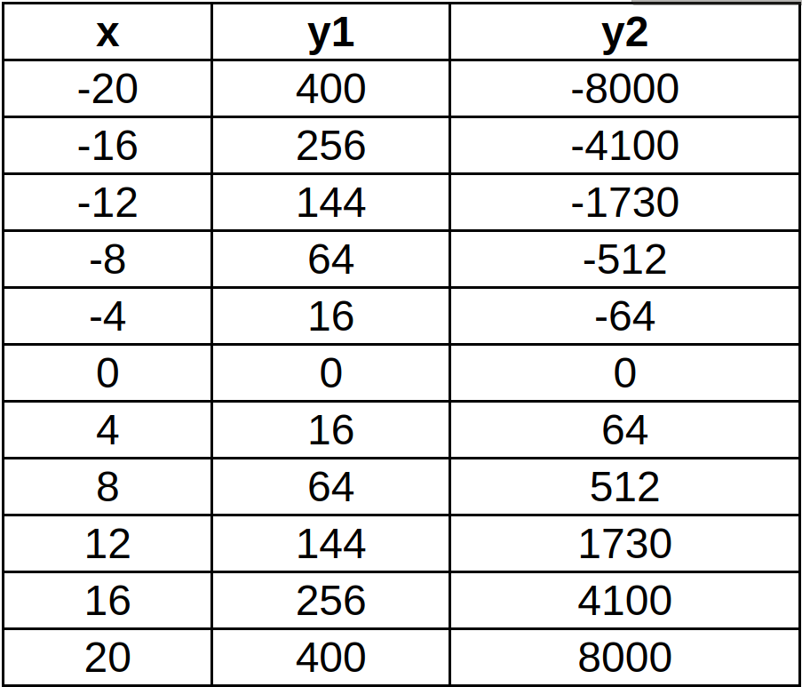
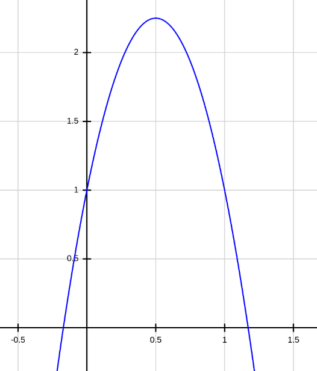

# 2D Graphing Calculator

https://aaronhe7.github.io/graphing-calculator/

*Example graph of  y = x^3 + 6x^2 + x - 15*

This project is a graphing calculator made using JavaScript, inspired by the TI-84 calculator made by Texas Instruments. It has the ability to graph almost any function that can be graphed on a TI-84 (polynomial, trigonometric, exponential, etc.), and has features such as calculating the roots of an equation, or finding the intersection of two graphs. The project uses a library called [expr-eval](https://www.npmjs.com/package/expr-eval), which is used to interpret user-inputted math expressions, and webpack to bundle the JavaScript files.

## Table of Contents
* [ Features ](#features)
  * [ General ](#general)
  * [ Graphing ](#graphing)
  * [ Table ](#table)
  * [ Calculate ](#calculate)
* [ Newton's method ](#newtons-method)
  * [ Explanation ](#explanation)
* [ Applications ](#applications)

## Features
### General
Here is an example graph of functions that can be graphed with this calculator:

| Color  | Equation       |
|--------|----------------|
| Blue   | *20log10(x)*   |
| Red    | *1/2x^2-15*    |
| Orange | *4sin(1/40x^2)*|
| Green  | *2^x*          |

### Graphing
This graphing calculator can graph any polynomial, trigonometric, exponential, and logarithmic function. For polynomials, the syntax for the function is *a0 + a1x + a2x^2 + ... + anx^n*, where the *^* symbol represents exponentiation. Trigonometric functions inlude *sin*, *cos*, and *tan*, and functions can be composed inside of each other, for example *2^(sin(x^2))*.

### Table
The table displays the x-coordinate at every tick mark, and the corresponding y-coordinate, based off the equations entered in the functions tab. Here is a table where *y1* is *x^2* and *y2* is *x^3*.

### Calculate
This tab can either calculate the root of a graph, or the intersection point of two graphs based off of an inital guess. If the root cannot be found, the function either does not have a root, or a better guess needs to be made. If the function has more than one root, make a guess that is much closer to the desired root.

For the function *y = x^2 - 8x + 4* an initial guess of *0*, will yield the root *x = 0.535898*, however a guess of *8* will yield the root *x = 7.4641*. These roots are precise to the last decimal (The exact values are *x = 4 ± 2√3*).

## Newton's method
Newton's method is an algorithm that estimates the root of a function *f(x)*. It is used in this graphing calculator. The algorithm takes in an inital guess *x0*, and applies this recursion finitely many times:

*xn+1 = xn - f(xn)/f'(xn)*.

Note: the function *f'* is the derivative of *f*. The estimated root *xn* becomes more accurate as *n* increases.

### Explanation
The derivative function *f'(x)* is the slope of the line that is tangent to the function at *x*. Take the example function *f(x) = x2 - 8x + 4*, and suppose our initial guess *x0* is equal to *2*. Below is a diagram of the graphs of *f(x)* in blue, *x=2* in grey, and the tangent line to *f(x*) at *x=2* in green.

Now what Newton's method does is assume that *f(x)* somewhat follows the trend of the tangent line of *f(x)*, and now it takes *x1* as the root of the tangent line. Note that we are still off from the actual root, but as this process repeats, the approximation gets better.

How does it calculate the root of the tangent line? Well, the nice part about this algorithm is that it is very easy to calculate the root of a linear equation. We can do this by using the slope equation for the line, *m = Δy/Δx*. In this case, we are considering the two points *(x0, f(x0))*, and *(x1, 0)*. This tells us that *m = f'(x0)*,  *Δy = f(x0) - 0 = f(x0)*, and *Δx = x0 - x1*. This gives the equation, *f'(x0) = f(x0)/(x0 - x1)*, which rearranges to *x1 = x0 - f(x0)/f'(x0)*.

Now we can compute *x1* from our initial guess *x0 = 2*:

 *x1 = 2 - f'(2)/f(2) = 2 - (22 - 8(2) + 4)/(2(2) - 8) = 2 - (-8)/(-4) = 0.* This is much closer than our initial guess *x0 = 2*. We can repeat this process as many times as possible for an answer more precise than ever needed.

## Applications
### Modeling the throw of a ball
Suppose a ball is thrown straight up at *5m/s*, from *1m* above the ground with a gravity of *-10m/s2*. Then the equation, *y = -5x^2 + 5x + 1* models the height of the ball (y-axis) with respect to time (x-axis). Here is the graph:

Now we can use the calculator to answer two questions:

1. At what time does the ball hit the ground again?
2. What is the maximum height of the ball, and at what time is it achieved?

To answer the first question, use the calculate root function and input a guess of *1*. This gives the root *x = 1.17082*, so the answer is 1.17082 seconds.

For the second question, find the leftmost root with a guess of *-1*, which gives *x = -0.17082*. Now we can average the two times to get the time where the maximum height is achieved, which is at (1.17082 - 0.17082)/2 = 0.5 seconds. Now open the table tab to find that the *y* value at *x = 0.5* is *2.25*. Our answer is 2.25 meters after 0.5 seconds.